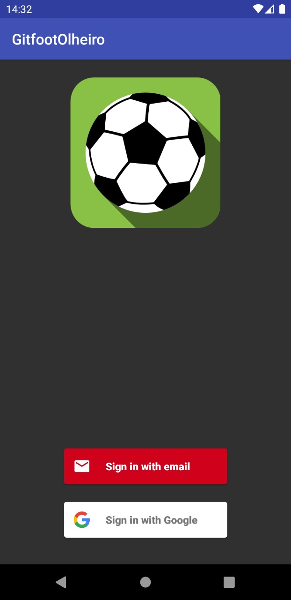
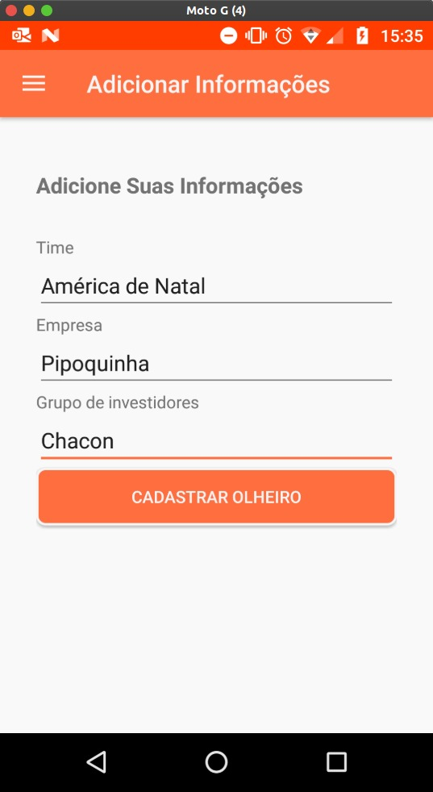
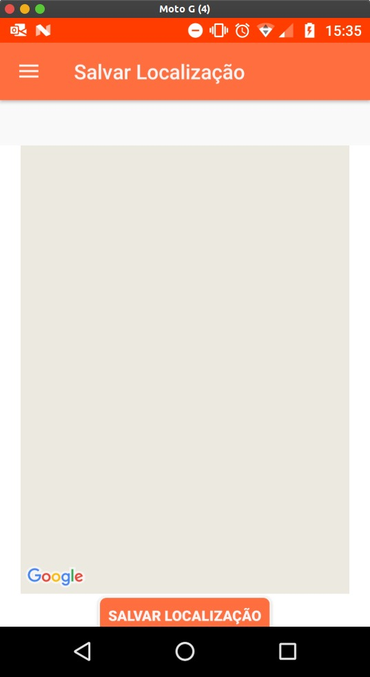
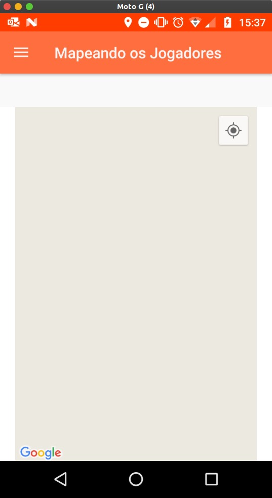
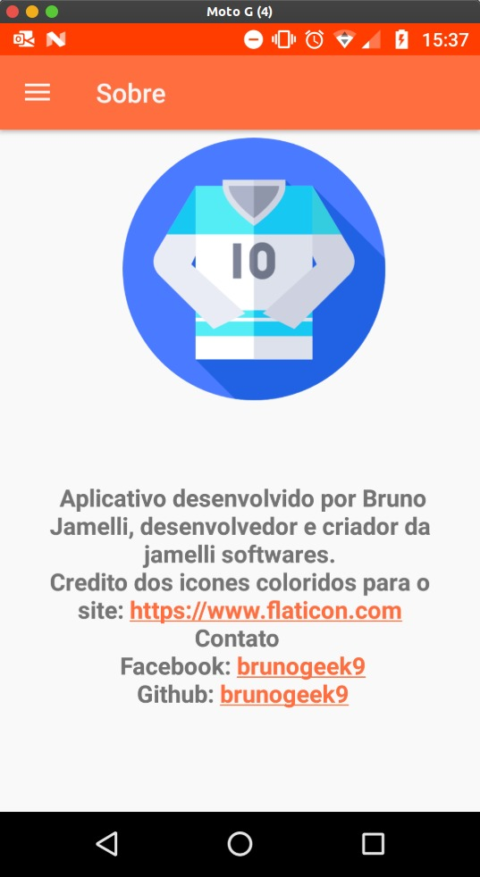

<h1 align="center">
 
  
 
 
GITFOOT SCOUT
</h1>

Application for scouts on the gitfoot platform.

  

[//]: # (Add your gifs/images here:)

  
  
  
  
  
  
  

## Features
[//]: # (Add the features of your project here:)
This application proves the possibility of scouts to register on the gitfoot platform as well as to visualize the players next to it.

- **firebase-database** — A real-time database for web and mobile applications.
- **firebase-ui-auth** — 
a library that provides both the backend and frontend ready to login with providers from various social networks.
- **maps-utils** — Library for using maps and real-time location api from google maps.

## Getting started

Describe here the way to use/install your project

## License

This project is licensed under the MIT License - see the [LICENSE](https://opensource.org/licenses/MIT) page for details.